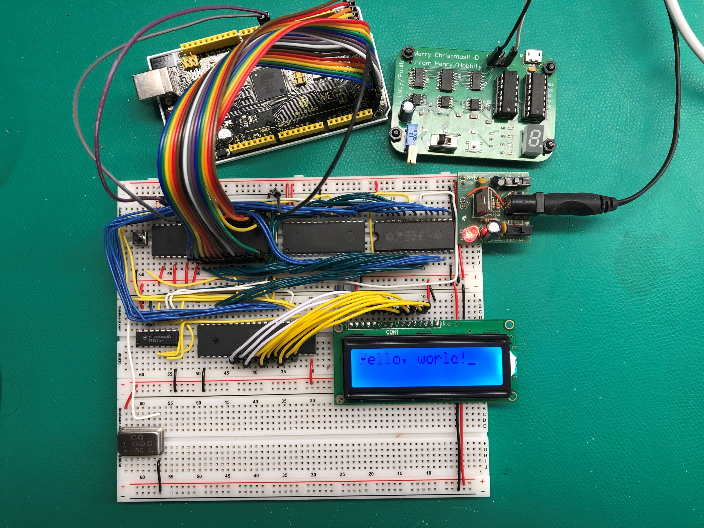

# Build a 6502 computer

Vids 1-12 by [Casey Dunn](https://github.com/caseywdunn)

Vids 12 onwards by [Zeul](https://github.com/zeulewan/)

Files for my build of Ben Eater's excellent 6502 breadboard computer. More
from him at https://eater.net/6502.

## Memory map

With reference to https://www.reddit.com/r/beneater/comments/doytpo/6502_project_memory_map/

| Chip | Range | Description |
| --- | --- | --- |
| RAM | `$0000` - `$00ff` | Zero page |
| RAM | `$0100` - `$01ff` | Stack |
| RAM | `$0200` - `$3fff` | General RAM |
| Open | `$4000` - `$5fff` | Not mapped to a device |
| 6522 | `$6000` | I/O Register B |
| 6522 | `$6001` | I/O Register A |
| 6522 | `$6002` | Data Direction Register B |
| 6522 | `$6003` | Data Direction Register A |
| 6522 | `$6004` | T1 Low Order Latches/Counter |
| 6522 | `$6005` | T1 High Order Counter |
| 6522 | `$6006` | T1 Low Order Latches |
| 6522 | `$6007` | T1 High Order Latches |
| 6522 | `$6008` | T2 Low Order Latches/Counter |
| 6522 | `$6009` | T2 High Order Counter |
| 6522 | `$600a` | Shift Register |
| 6522 | `$600b` | Auxiliary Control Register |
| 6522 | `$600c` | Peripheral Control Register |
| 6522 | `$600d` | Interrupt Flag Register |
| 6522 | `$600e` | Interrupt Enable Register |
| 6522 | `$600f` | I/O Register A sans Handshake |
| 6522 | `$6010` - `7fff` | Mirrors of the sixteen VIA registers |
| 28C256 | `$8000` - `$ffff` | ROM |

## Writing assembly

The machine code is put on the ROM starting at $0 (relative to the actual ROM address)

The `.org` directive tells the assembler where the CPU thinks the address will be.

- Starting the assembly code with `.org $8000` tells the assemlber that the CPU address space for the ROM starts at `$8000`

- Subsequent `.org` directives will place data into the ROM at the specified address (in CPU address space)

Here is an annotated version of blink.s:

      .org $8000    ; Though written to the first address in the ROM, $0,
                    ; this code will appear to the CPU to be at $8000

    reset:          ; This label marks the first position in the ROM for
                    ; the CPU is $8000
      lda #$ff
      sta $6002

      lda #$50
      sta $6000

    loop:
      ror
      sta $6000

      jmp loop

      .org $fffc   ; Specify that the following code will go at the position
                   ; that appears to the CPU to be at $fffc. $fffc is the
                   ; location of the reset vector. The value at this vector
                   ; is loaded into the program counter after a CPU reset.

      .word reset  ; Place the value of the label reset, ie $8000, at this
                   ; position

      .word $0000  ; Pad out the last couple bytes

## Software

There are a couple tools needed to build the binaries and get them on the ROM. Here is how to install them on linux.

To install vasm:
    wget http://sun.hasenbraten.de/vasm/release/vasm.tar.gz
    tar xvzf vasm.tar.gz
    cd vasm
    make CPU=6502 SYNTAX=oldstyle
    cp vasm6502_oldstyle /usr/bin
    cp vobjdump /usr/bin

To install minipro:
    git clone https://gitlab.com/DavidGriffith/minipro.git
    cd minipro
    make
    make install

Command that zeul uses to compile, view and upload binary:

    ./vasm6502_oldstyle -Fbin -dotdir helloworld.s && hexdump -C a.out &&  minipro -p 28C256 -uP -w a.out

## Code for videos

I've slightly modified some of the commands and code to have incremental
versions of some of the programs he iterates on.

### Video 1 

There are no commands for [video 1](https://www.youtube.com/watch?v=yl8vPW5hydQ).
All the software is hardwired resistors.

"My favorite programming language is solder." - [Todd Whitehurst](https://www.google.com/books/edition/The_Art_and_Science_of_Analog_Circuit_De/SPwqg7qpFWUC?hl=en&gbpv=1&dq=bob%20pease%20richard%20feynman&pg=PA41&printsec=frontcover) (or Bob Pease?)

### Video 2

Commands for [video 2](https://www.youtube.com/watch?v=yl8vPW5hydQ).

First, the bin with just `ea` values.

    python vid02_makerom_ea.py
    hexdump -C rom_ea.bin
    minipro -p AT28C256 -w rom_ea.bin

Now the full binary.

    python vid02_makerom.py
    hexdump -C rom.bin
    minipro -p AT28C256 -w rom.bin

### Video 3

Commands for [video 3](https://www.youtube.com/watch?v=oO8_2JJV0B4).

    vasm6502_oldstyle -Fbin -dotdir vid03_blink.s
    hexdump -C a.out
    minipro -p AT28C256 -w a.out

### Video 4

Commands for [video 4](https://www.youtube.com/watch?v=oO8_2JJV0B4).

    vasm6502_oldstyle -Fbin -dotdir vid04_hello-world.s
    hexdump -C a.out
    minipro -p AT28C256 -w a.out

Code: [vid04_helloworld.s](vid04_helloworld.s)

### Video 5

Commands for [video 5](https://www.youtube.com/watch?v=xBjQVxVxOxc).

    vasm6502_oldstyle -Fbin -dotdir vid05hello-world.s
    hexdump -C a.out
    minipro -p AT28C256 -w a.out

Code: [vid05_helloworld.s](vid05_helloworld.s)

### Video 7

Commands for [video 7](https://www.youtube.com/watch?v=omI0MrTWiMU).

    vasm6502_oldstyle -Fbin -dotdir vid07_hello-world.s
    hexdump -C a.out
    minipro -p AT28C256 -w a.out

Code: [vid07_helloworld.s](vid07_helloworld.s)

### Video 8

[Why build an entire computer on breadboards?](https://youtu.be/fCbAafKLqC8)

No new code.

### Video 9

[How assembly language loops work](https://youtu.be/ZYJIakkcLYw)

Code: [vid09_helloworld.s](vid09_helloworld.s)

### Video 10

[Binary to decimal can’t be that hard, right?](https://youtu.be/v3-a-zqKfgA)

At about 1:31 in the video, he shows a file I here call [vid10_42.s](vid10_42.s).

Then at 19:10 in the video, he starts making edits for what I call [vid10_bin2dec.s](vid10_bin2dec.s). In the video, it is called `bin2dec.s`.

### Video 11

[Hardware interrupts](https://youtu.be/DlEa8kd7n3Q)

Code [vid11_interrupts.s](vid11_interrupt.s)

### Video 12

[Interrupt handling](https://youtu.be/oOYA-jsWTmc)

Code: [vid12_interrupts.s](vid12_interrupts.s)

### Video 13

[So how does a PS/2 keyboard interface work?](https://youtu.be/7aXbh9VUB3U)

I had to use a HC299 because home hardware ran out of HC595s

### Video 14

[Keyboard interface hardware](https://youtu.be/7aXbh9VUB3U)

Ben switches the LCD into 4 bit mode without telling us. He made a [patreon post](https://www.patreon.com/posts/4-bit-lcd-50900073) about it. Which you'll have to spend 3 bucks on.

To do: fix the code when the PCB comes

### Video 15

[Keyboard interface software](https://youtu.be/dL0GO9SeBh0)

Code: [vid15_keyboard.s](vid15_keyboard_software/vid15_keyboard.s)

### Video 16

[SPI: The serial peripheral interface](https://youtu.be/MCi7dCBhVpQ)

Code up to minute 23. I never made loop or printed it to the LCD: [vid16_SPI1.s](vid16_SPI/vid16_SPI1.s)

### Video 17

[How do hardware timers work?](https://youtu.be/g_koa00MBLg)

[Software timer](vid17_timers/vid17_timers_software.s)

[one shot timer](vid17_timers/vid17_timers_t1_oneshot.s)

[free run timer](vid17_timers/vid17_timers_t1_freerun.s)

## Similar repositories

<https://github.com/lukeshiner/6502_computer>
